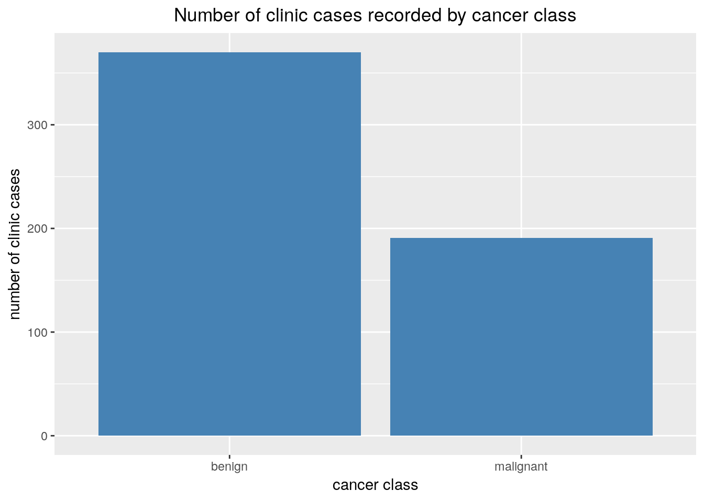
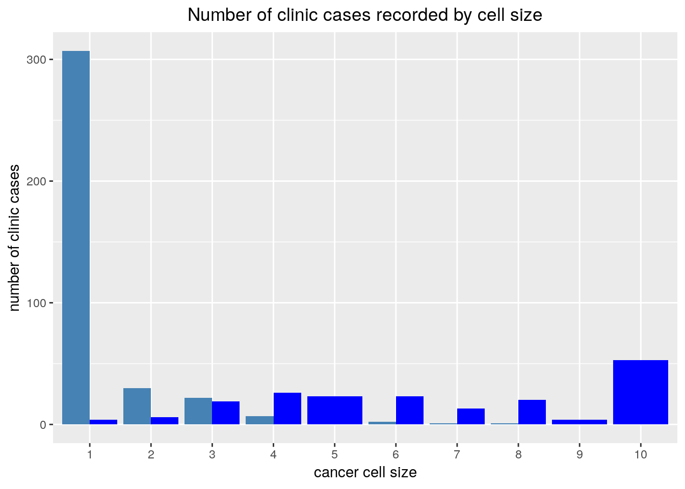
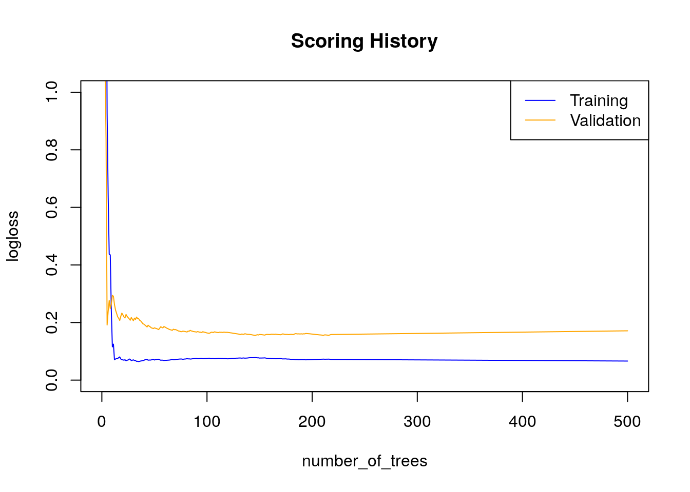

# Simple Example    
This is a small example to demonstrate how one can create a ML workflow in h2o via R. We will use the breast cancer data set from the mlbench package.   
     
## Start an instance of H2O     

Start H2O using localhost IP, port 54321, all CPUs,and 6g of memory. The recommendation for max_mem_size is 4X the size of the data set. The 6gig is clearly over kill given the size of the data used in this example,but ah!  


     

```r
library(h2o)
# Starts H2O using localhost IP, port 54321, all CPUs,and 6g of memory
h2o.init(ip = 'localhost', port = 54321, nthreads= -1,max_mem_size = '6g')
```
     
## Data preparation   
   
### read in data

#### from R dataframe to h2oFrame  

The function *as.h2o()* converts an R dataframe to an H2OFrame in the h2o instance. Some features have their type set to ordered factors and *as.h2o()* seems to have a problem with parsing ordered factors. Before the conversion we convert to unordered factor variables.


     

```r
library(dplyr)
library(mlbench)
library(purrr)

# load the data set into environment
data(BreastCancer)

# convert data frame to an H2OFrame
BreastCancer_h2o <- map(BreastCancer,factor,ordered = F) %>% 
                    as.data.frame() %>% # map returns list, coerce that to a df
                    as.h2o() # convert to h2oFrame

# can call head to confirm data was transfared correctly
h2o.head(BreastCancer_h2o)
```
     
#### reading data directly into h2o   
In most cases data will not be in R but from some other data source like a csv file or a Hadoop cluster. In fact chances are the main reason one even considered h2o is to scale R to working with large scale data sets, so first importing data into R then push it to an h2o instance wouldn't be particularly helpful. The code below reads in a csv file stored locally on the host machine, further info in loading data from other sources can be found in the documentation [here](http://docs.h2o.ai/h2o/latest-stable/h2o-docs/getting-data-into-h2o.html)   


```r
data_path <- "./data/BreastCancer.csv"
BreastCancer_h2o <- h2o.importFile(path = data_path,
                                   destination_frame = "BreastCancer_h2o",
                                   header = T,
                                   col.types = rep("Enum",11)) # Enum is a factor
```
      
Once loaded the data can also be viewed in h2o flow at localhost:54321 using the *getFlow* command
    
### split data    
According to the documentation the *h2o.splitFrame()* function doesn't perform an exact split as specified by the proportions but an approximate split. For the most part this isn't an issue when dealing with large amounts of data. When dealing with small data sets and data sets with imbalanced data though, it may become something worth paying attention to.


```r
BreastCancer_h2o_split_vec <- h2o.splitFrame(BreastCancer_h2o,
                                             ratios = 0.80,
                                             seed = 820)
train_h20 <- BreastCancer_h2o_split_vec[[1]]
test_h2o <- BreastCancer_h2o_split_vec[[2]]
```
     

     
## Data exploration  
Here we showcase some functions h2o offers as far as data exploration and manipulation is concerned. For the most part h2o feels like performing surgery with a butter knife, especially to someone used to dealing with relatively small data sets, just keep in mind that it's mainly designed for efficiency with huge data sets, and that it does beautifully. For data sets small enough to be read into R, it may be less frustrating to pull the h2oFrame into R as a data frame using *as.data.frame(h2oFrame_object)*, wrangle and explore the data using the mighty dplyr package then push the data back into h2o for training.    

### get dimensions    


```r
h2o.dim(train_h20)
```

```
[1] 561  11
```
     
### glimpse   
Some R functions (e.g head,dim) seem to work on h2oFrames as though the operations are done in R, however, it may be wise to keep prepending the functions with the standard **h2o.** prefix even in such cases to make operations not done in R explicitly clear.


```r
h2o.head(train_h20,n=5) # controling number of observations to pull
```

```
       Id Cl.thickness Cell.size Cell.shape Marg.adhesion Epith.c.size
1 1000025            5         1          1             1            2
2 1002945            5         4          4             5            7
3 1015425            3         1          1             1            2
4 1016277            6         8          8             1            3
5 1017122            8        10         10             8            7
  Bare.nuclei Bl.cromatin Normal.nucleoli Mitoses     Class
1           1           3               1       1    benign
2          10           3               2       1    benign
3           2           3               1       1    benign
4           4           3               7       1    benign
5          10           9               7       1 malignant
```
    
### get summary statistics  


```r
h2o.describe(train_h20)
```

```
             Label Type Missing Zeros PosInf NegInf Min Max      Mean
1               Id enum       0     1      0      0   0 644        NA
2     Cl.thickness enum       0   119      0      0   0   9        NA
3        Cell.size enum       0   311      0      0   0   9        NA
4       Cell.shape enum       0   284      0      0   0   9        NA
5    Marg.adhesion enum       0   331      0      0   0   9        NA
6     Epith.c.size enum       0    38      0      0   0   9        NA
7      Bare.nuclei enum      13   328      0      0   0   9        NA
8      Bl.cromatin enum       0   115      0      0   0   9        NA
9  Normal.nucleoli enum       0   354      0      0   0   9        NA
10         Mitoses enum       0   463      0      0   0   8        NA
11           Class enum       0   370      0      0   0   1 0.3404635
      Sigma Cardinality
1        NA         645
2        NA          10
3        NA          10
4        NA          10
5        NA          10
6        NA          10
7        NA          10
8        NA          10
9        NA          10
10       NA           9
11 0.474288           2
```
     

```r
h2o.summary(train_h20)
```

```
 Id         Cl.thickness Cell.size Cell.shape Marg.adhesion Epith.c.size
 1182404:4  1 :119       1 :311    1 :284     1 :331        2:314       
 1276091:4  5 :104       10: 53    2 : 49     3 : 46        3: 54       
 1198641:3  3 : 86       3 : 41    3 : 47     10: 45        4: 41       
 1061990:2  4 : 64       2 : 36    10: 45     2 : 45        1: 38       
 1105524:2  10: 54       4 : 33    4 : 34     4 : 23        6: 31       
 1114570:2  2 : 41       6 : 25    6 : 25     8 : 23        5: 29       
                                                                        
 Bare.nuclei Bl.cromatin Normal.nucleoli Mitoses Class         
 1 :328      2:142       1 :354          1 :463  benign   :370 
 10:103      3:138       10: 49          2 : 29  malignant:191 
 5 : 25      1:115       3 : 36          3 : 25                
 2 : 22      7: 57       2 : 29          10: 12                
 3 : 22      4: 31       8 : 19          4 :  9                
 8 : 18      5: 23       6 : 18          7 :  9                
 NA: 13                                                        
```

     
### create summary table    
#### one variable  

We create a simple frequency bar plot showing the frequencies of each of the Class variable levels. We create a table of all the counts in h2o then pull it into r as a data frame for plotting. This seemed like a nice opportunity to demonstrate the conversion of an h2oFrame into an R dataframe.  
     

```r
library(ggplot2)
library(dplyr)

h2o.table(train_h20[,"Class"]) %>% # create table in h20
    as.data.frame() %>% # convert h2oFrame to dataframe and feed to ggplot
    ggplot(aes(x=Class,y=Count))+
            geom_bar(stat="identity", fill="steelblue")+
            labs(title='Number of clinic cases recorded by cancer class',
                 x='cancer class',
                 y='number of clinic cases')+
             theme(plot.title = element_text(hjust = 0.5))
```


     
#### two variables   
This generalises to n variables   

```r
level_order <- c("1","2","3","4","5","6","7","8","9","10")
h2o.table(train_h20[,c("Class","Cell.size")]) %>% # create table grouping by Class & Cell.size
    as.data.frame() %>% # convert h2oFrame to dataframe
    mutate(Cell.size=ordered(Cell.size,levels=level_order)) %>% # convert Cell.size to ordered factor
    ggplot(aes(x=Cell.size,y=Counts,fill = Class))+
            geom_bar(stat="identity",position = "dodge")+
            labs(title='Number of clinic cases recorded by cell size',
                 x='cancer cell size',
                 y='number of clinic cases')+
             theme(plot.title = element_text(hjust = 0.5))+
             scale_fill_manual(guide= FALSE,
                               values = c(benign="steelblue",
                                          malignant="blue")
                               )
```


     
### missing values    
The *h2o.describe()* function revealed that the Bare.nuclei variable has 13 missing values we impute with the mode  

     

```r
h2o.impute(data=train_h20,
           column = "Bare.nuclei",
           method = "mode")
```


      
## Model building    
A number of algorithms have been implemented in h2o. A full list can be found in the documentation [here](http://docs.h2o.ai/h2o/latest-stable/h2o-docs/data-science.html)    
    
### Random forest model   
     
#### train


```r
h2o_rf <- h2o.randomForest(y = "Class", # specify response variable
                           training_frame = train_h20,
                           validation_frame = test_h2o,
                           ntrees = 500,
                           nfolds = 10, # specify k in k-fold cv
                           seed = 3328) 
```
    

      
#### check performance metrics   
h2o Flow provides a really sweet graphical representation of all training metrics, it is definitely worth looking at. the flow also allows monitoring of metrics while training through performance graphs. Models can be accessed by running the command *getModels* in h20 flow. Below we explore how the performance can be viewed from R     


```r
h2o.performance(h2o_rf)
```

```
H2OBinomialMetrics: drf
** Reported on training data. **
** Metrics reported on Out-Of-Bag training samples **

MSE:  0.01727592
RMSE:  0.1314379
LogLoss:  0.06625494
Mean Per-Class Error:  0.01748267
AUC:  0.9985001
pr_auc:  0.9919338
Gini:  0.9970001
R^2:  0.9230636

Confusion Matrix (vertical: actual; across: predicted) for F1-optimal threshold:
          benign malignant    Error     Rate
benign       359        11 0.029730  =11/370
malignant      1       190 0.005236   =1/191
Totals       360       201 0.021390  =12/561

Maximum Metrics: Maximum metrics at their respective thresholds
                        metric threshold    value idx
1                       max f1  0.415569 0.969388 187
2                       max f2  0.415569 0.984456 187
3                 max f0point5  0.691324 0.986770 165
4                 max accuracy  0.691324 0.978610 165
5                max precision  1.000000 1.000000   0
6                   max recall  0.246980 1.000000 193
7              max specificity  1.000000 1.000000   0
8             max absolute_mcc  0.415569 0.953699 187
9   max min_per_class_accuracy  0.558049 0.975676 182
10 max mean_per_class_accuracy  0.415569 0.982517 187

Gains/Lift Table: Extract with `h2o.gainsLift(<model>, <data>)` or `h2o.gainsLift(<model>, valid=<T/F>, xval=<T/F>)`
```
    
One can't help but marvel at the wealth of information provided by the h2o model object, it is perhaps even more exciting that getting the kind of performance we got from our first model with practically no work done on the data. a thing of beauty indeed!
    

```r
plot(h2o_rf)
```


    

     
### Extreme gradient boosted model    
    
#### train   


```r
h2o_xgb <- h2o.xgboost(y = "Class", # specify response variable
                           training_frame = train_h20,
                           validation_frame = test_h2o,
                           ntrees = 500,
                           nfolds = 10, # specify k in k-fold cv
                           seed = 3328)
```
    

      
#### check performance metrics
     

```r
h2o.performance(h2o_rf)
```

```
H2OBinomialMetrics: drf
** Reported on training data. **
** Metrics reported on Out-Of-Bag training samples **

MSE:  0.01727592
RMSE:  0.1314379
LogLoss:  0.06625494
Mean Per-Class Error:  0.01748267
AUC:  0.9985001
pr_auc:  0.9919338
Gini:  0.9970001
R^2:  0.9230636

Confusion Matrix (vertical: actual; across: predicted) for F1-optimal threshold:
          benign malignant    Error     Rate
benign       359        11 0.029730  =11/370
malignant      1       190 0.005236   =1/191
Totals       360       201 0.021390  =12/561

Maximum Metrics: Maximum metrics at their respective thresholds
                        metric threshold    value idx
1                       max f1  0.415569 0.969388 187
2                       max f2  0.415569 0.984456 187
3                 max f0point5  0.691324 0.986770 165
4                 max accuracy  0.691324 0.978610 165
5                max precision  1.000000 1.000000   0
6                   max recall  0.246980 1.000000 193
7              max specificity  1.000000 1.000000   0
8             max absolute_mcc  0.415569 0.953699 187
9   max min_per_class_accuracy  0.558049 0.975676 182
10 max mean_per_class_accuracy  0.415569 0.982517 187

Gains/Lift Table: Extract with `h2o.gainsLift(<model>, <data>)` or `h2o.gainsLift(<model>, valid=<T/F>, xval=<T/F>)`
```

    

```r
plot(h2o_rf)
```


     
## Some last thoughts   
H2o is indeed an awesome tool with a moderate learning curve relative to something like sparklyr (provides an interface for Apache Spark in R). Though powerful, h2o should probably be thought of as supplementing the language it is used in and not as a substitute. If you are interested in learning more about H2O the documentation is probably the next best alternative to look at.


     


     
